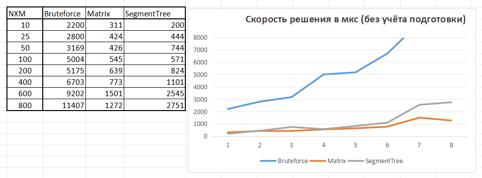

# Algorithms and data structures. Laboratory work № 2
Here is the second laboratory work on algorithms. It was prepared and performed by Arseniy Nikitin, a student of Group 22PI2 of the Higher School of Economics. We are faced with the following task: There is some random number of rectangles and a random number of points. It is necessary to determine as efficiently as possible how many rectangles each point given to us belongs to.
We will consider three algorithms:
- The brute force algorithm
- Compressed matrix algorithm
- Algorithm of a persistent tree of segments  


${\color{lightgreen}RU:}$ Это вторая лабораторная работа по алгоритмам. Она была подготовлена и выполнена Арсением Никитиным, студентом группы 22PI2 Высшей школы экономики. Перед нами стоит следующая задача: имеется некоторое случайное количество прямоугольников и случайное количество точек. Необходимо максимально эффективно определить, скольким прямоугольникам принадлежит каждая заданная нам точка.
Мы рассмотрим три алгоритма:
- Алгоритм грубой силы
- Алгоритм сжатой матрицы
- Алгоритм построения постоянного дерева сегментов
# Let's take a closer
 ### 1) Brute force algorithm
 **Difficulty of implementation** ★☆☆☆☆  (Сложность реализации)  
Preparation difficulty: _**O(1)**_  (Сложность подготовки)  
Search difficulty: _**O(N)**_  (Сложность поиска)  
The final complexity is _**O(N * M)**_  (Итоговая сложность)  

__Solution__:  
The implementation is extremely simple. We iterate through each rectangle for each point and check if its coordinates are inside.  
${\color{lightgreen}RU:}$ Реализация чрезвычайно проста. Мы перебираем каждый прямоугольник для каждой точки и проверяем, находятся ли ее координаты внутри.


### 2) Compressed matrix algorithm
 **Difficulty of implementation** ★★★☆☆  


Preparation difficulty: _**O(N^3)**_  
Search difficulty: _**O(log(N))**_  
The final complexity is _**O(N^3 + M * log(N))**_  

__Solution__:  
At the preparation stage, we are building a matrix. Next, we use a binary search to search for our interval and return the result from the matrix.   
${\color{lightgreen}RU:}$ На этапе подготовки мы строим матрицу. Далее мы используем бинарный поиск для поиска нашего интервала и возвращаем результат из матрицы.
### 3) Persistent tree of segments  
 **Difficulty of implementation** ★★★★★  


Preparation difficulty: _**O(N * log(N))**_  
Search difficulty: _**O(log(N))**_  
The final complexity is _**O(N * log(N) + M * log(N))**_  

__Solution__:  
To begin with, we prepare all the lines according to the X coordinate. Then we build a persistent tree and look for our X and Y intervals in it.  
${\color{lightgreen}RU:}$ Для начала мы подготавливаем все линии в соответствии с координатой X. Затем мы строим постоянное дерево и ищем в нем наши интервалы X и Y при помощи бинарного поиска.  

# Launch
```bash
cd *путь до файла*
git clone https://github.com/Mr-Darkson/Research.-Algorithms-and-data-structures-2.git
```
Next, compile and run

```
javac Main.java
java src/main/java/me/absolute/Main.java
```
# Results
First, let's look at the overall speed of the algorithms. The calculations include preparation + solution. We can see that brute force shows itself in the best way. But in fact, it's not that simple. The fact is that this will be relevant only in cases where it will be necessary to determine the occurrence of points in rectangles only once.  

Let's look at a graph that shows the speed of solving the problem only.  
On it, we can see that in fact the matrix and the segment tree show results many times better than the brute force. However, the matrix still benefits slightly from tree. Then why do we need such a complex algorithm if it's easier to write a matrix?

The following chart will answer us. The preparation time required by the matrix is quite long in comparison with tree.


---
## Conslusoion
Based on the research, we can conclude that the algorithm based on the segment tree is the most optimal if you need to calculate the occurrence of points in rectangles several times. If you need to do this only once, choose brut force. And it may be worth trying the matrix if the amount of data to search is small.  
${\color{lightgreen}RU:}$
На основании проведенного исследования мы можем сделать вывод, что алгоритм, основанный на дереве сегментов, является наиболее оптимальным, если вам нужно несколько раз вычислить вхождение точек в прямоугольники. Если вам нужно сделать это только один раз, выберите метод грубой силы. И, возможно, стоит попробовать использовать матрицу, если объем данных для поиска невелик.
